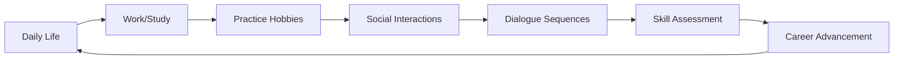

# Language Learning Life Simulation Game

A comprehensive **Sims-like life simulation game** focused on **language learning through dialogue mastery**. Players advance their careers, build relationships, and develop life skills while learning Spanish through realistic conversation scenarios across different regional dialects.

## 🎯 Core Concept

This game combines **life simulation mechanics** with **scientifically-grounded language learning**:
- **Career progression** depends on dialogue skills and cultural understanding
- **Pronunciation accuracy** and **grammar mastery** directly impact social and professional success  
- **Regional dialect variations** (Argentina, Spain, Mexico, etc.) create authentic learning experiences
- **Comprehensive testing system** provides randomized assessments across different contexts
- **Nathan Hoad's Dialogue Manager integration** enables dynamic, condition-based conversations

## 🏗️ Project Architecture

### Core Files

```
GameState.gd          # Central game state management & language learning systems
EventBus.gd          # Comprehensive event management for all game systems  
DialogueManager.gd   # Nathan Hoad's dialogue system (external dependency)
```

### Key Systems Overview

| System | Description | Key Features |
|--------|-------------|--------------|
| **Life Simulation** | Sims-like career, hobbies, relationships | 7 career paths, 10+ hobbies, location-based activities |
| **Dialogue Mastery** | Core language learning through conversations | 5-step perfect sequences, context-aware choices |
| **Phonetics System** | Regional pronunciation & accent training | IPA notation, dialect variations, accuracy tracking |
| **Grammar System** | Structured grammar learning by difficulty | 40+ rules, complexity progression, contextual practice |
| **Testing Framework** | Randomized assessments & skill verification | 4 test types, adaptive difficulty, comprehensive analytics |
| **Career Integration** | Jobs requiring specific language competencies | Teacher, Doctor, Translator, etc. with dialogue requirements |
| **Mentor Quests** | Structured progression through difficulty grades | Easy → Normal → Hard → Master across all skill areas |

## 🎮 Gameplay Loop



## 💬 Dialogue System Integration

### Nathan Hoad's Dialogue Manager

The game integrates with Nathan Hoad's robust dialogue system for dynamic conversations:

```gdscript
# Available in dialogue conditions (.dialogue files):
~ if player_level >= 5 and confidence > 70
~ if job_title == "Teacher" and dialogue_mastery >= 3  
~ if current_location == "cafe" and charisma >= 4
~ if pronunciation_accuracy >= 80 and argentinian_familiarity > 50

# Available mutations from dialogue:
set dialogue_add_money(100)
set dialogue_add_experience("charisma", 15)  
set dialogue_practice_pronunciation("ll", "ARGENTINA")
set confidence += 5
```

### Dialogue Quality Evaluation

Every dialogue choice is evaluated across multiple dimensions:

- **Choice Quality**: Poor → Acceptable → Good → Excellent → Perfect
- **Context Appropriateness**: Formal vs Casual vs Business contexts
- **Pronunciation Accuracy**: Regional accent familiarity modifiers
- **Grammar Correctness**: Contextual grammar importance (formal > casual)
- **Cultural Sensitivity**: Understanding social norms and customs

## 🔤 Linguistics Systems

### Phonetics & Pronunciation

**Comprehensive phonetic inventory with regional variations:**

```gdscript
# Example: Argentinian "LL" pronunciation
"ll": {
    "ipa": "/ʎ/",
    "regional_variants": {
        DialectRegion.ARGENTINA: "/ʃ/",    # "lluvia" → "shuvia"  
        DialectRegion.MEXICO: "/j/",       # "lluvia" → "yuvia"
        DialectRegion.SPAIN: "/ʎ/"         # Traditional lateral
    }
}
```

**Key Features:**
- **IPA notation** for precise sound representation
- **Regional dialect training** (Argentina, Spain, Mexico, Colombia, Chile, Peru)
- **Pronunciation accuracy tracking** (0-100% scale)
- **Accent rating progression** (beginner → intermediate → advanced → native-like)

### Grammar System

**Structured progression through Spanish grammar complexity:**

| Level | Grammar Concepts | Examples |
|-------|------------------|----------|
| 1-2 | Basic gender, present tense | "la mesa", "hablo" |
| 3-5 | Past tenses, pronouns | "hablé", "lo veo", "me gusta" |
| 6-8 | Subjunctive, conditionals | "Si tuviera...", "Es importante que hables" |
| 9-10 | Complex structures | Passive voice, relative clauses |

## 🧪 Testing & Assessment System

### Test Types

1. **Quick Assessment** (15 min) - Daily skill checks across random contexts
2. **Comprehensive Exam** (45 min) - Full evaluation at level milestones  
3. **Context Challenge** (25 min) - Theme-focused practice (professional, social, cultural)
4. **Skill Verification** (30 min) - Adaptive testing targeting weak areas

### Random Dialogue Selection Strategies

```gdscript
# Test configuration examples:
"contexts": "random_single"    # One context, multiple scenarios
"contexts": "all_contexts"     # Ensure coverage across all contexts  
"contexts": "adaptive"         # 70% weak areas, 30% strong areas
"contexts": "theme_based"      # Related contexts (e.g., professional)
```

## 💼 Career & Life Simulation

### Available Careers

| Career | Requirements | Dialogue Contexts | Daily Salary |
|--------|--------------|-------------------|--------------|
| Office Worker | Intelligence 2, Social Skills 1 | Business, Formal | $120 |
| Teacher | Dialogue Mastery 3, Charisma 2 | Educational, Cultural | $150 |
| Doctor | Intelligence 5, Dialogue Mastery 4 | Formal, Emotional, Technical | $300 |
| Translator | Dialogue Mastery 5, Cultural Understanding 4 | Cultural, Technical, Formal | $200 |

### Hobbies & Personal Development

| Hobby | Energy Cost | Benefits | Dialogue Bonus |
|-------|-------------|----------|----------------|
| Pronunciation Drills | 15 | Phonetics +4, Accuracy +3% | Formal +40%, All contexts +10% |
| Grammar Exercises | 20 | Grammar +4, Accuracy +4% | Formal +40%, Technical +30% |
| Dialect Immersion | 30 | Phonetics +3, Cultural +3 | Cultural +50%, Casual +20% |
| Conversation Lab | 25 | Dialogue +3, Confidence +3 | Casual +30%, All contexts +10% |

## 🎯 EventBus Architecture

The EventBus provides 100+ signals organized into categories:

```gdscript
# Linguistics Events
EventBus.phoneme_mastered.connect(_on_phoneme_mastered)
EventBus.grammar_rule_practiced.connect(_update_grammar_ui)

# Career Events  
EventBus.promotion_achieved.connect(_celebrate_promotion)
EventBus.work_day_completed.connect(_update_performance_stats)

# Testing Events
EventBus.test_completed.connect(_show_results)
EventBus.certification_earned.connect(_unlock_new_opportunities)
```

## 🚀 Development Workflow

### AI-Assisted Development with Codex

This project is designed for collaborative development with AI assistants:

**Example Codex Prompts:**

```
"Using the GameState.gd framework, create a pronunciation practice UI that shows IPA symbols, plays audio samples, and tracks accuracy for different regional dialects."

"Build a career advancement dialog that checks player qualifications using Nathan Hoad's dialogue conditions and grants promotions through mutations."

"Create a test results analytics dashboard that visualizes performance across different dialogue contexts and suggests personalized study plans."
```

### Key Integration Points

1. **GameState Functions**: All game logic centralized for AI understanding
2. **EventBus Signals**: Clear event-driven architecture  
3. **Dialogue Manager**: Nathan Hoad's system handles conversation flow
4. **Modular Components**: Each system can be developed independently

## 📚 API Reference

### Core GameState Functions

```gdscript
# Language Learning
GameState.practice_phonetics(phoneme_id: String, region: DialectRegion) -> Dictionary
GameState.practice_grammar(grammar_rule_id: String) -> Dictionary
GameState.assess_pronunciation(text: String, target_region: DialectRegion) -> Dictionary

# Dialogue System
GameState.start_dialogue_sequence(sequence_type: String, npc_name: String) -> bool
GameState.make_dialogue_choice(quality: DialogueChoiceQuality, text: String, appropriate: bool) -> Dictionary

# Career & Life
GameState.apply_for_job(job_type: JobType) -> bool
GameState.work_today() -> Dictionary
GameState.practice_hobby(hobby_id: String) -> Dictionary

# Testing & Assessment
GameState.start_dialogue_test(test_type: String) -> Dictionary
GameState.get_test_analytics() -> Dictionary
GameState.get_test_recommendations() -> Dictionary
```

### Nathan Hoad Integration Functions

```gdscript
# Available in dialogue files:
GameState.get_dialogue_manager_linguistics_state() -> Dictionary

# Available as dialogue mutations:
dialogue_practice_pronunciation(phoneme: String, region: String)
dialogue_study_grammar(rule: String)
dialogue_add_relationship(npc_name: String, points: int)
```

## 🎨 UI Development Guidelines

### Key UI Components Needed

1. **Dialogue Interface** - Choice presentation with quality indicators
2. **Pronunciation Trainer** - IPA display, waveform analysis, regional selector
3. **Grammar Practice** - Interactive exercises with immediate feedback
4. **Career Dashboard** - Job performance, promotion requirements, skill gaps
5. **Test Interface** - Progress tracking, randomized question presentation
6. **Analytics Dashboard** - Performance trends, strength/weakness analysis
7. **Character Stats** - Comprehensive skill display with linguistic competencies

### EventBus Integration

```gdscript
# UI components should connect to relevant EventBus signals:
func _ready():
    EventBus.pronunciation_accuracy_changed.connect(_update_pronunciation_display)
    EventBus.grammar_rule_mastered.connect(_show_mastery_celebration)
    EventBus.test_completed.connect(_display_test_results)
    EventBus.dialogue_sequence_completed.connect(_update_conversation_history)
```

## 🔧 Technical Specifications

### Engine & Dependencies
- **Godot 4.4+**
- **Nathan Hoad's Dialogue Manager** (external plugin)
- **JSON save/load system** for persistent progress
- **Event-driven architecture** for loose coupling

### Performance Considerations
- **Centralized state management** prevents data duplication
- **EventBus batching** for efficient UI updates  
- **Lazy loading** of phonetic and grammar inventories
- **Compressed save files** for large vocabulary datasets

### Extensibility
- **Modular phoneme inventory** - easily add new sounds/languages
- **Flexible grammar system** - supports any language's grammatical concepts
- **Configurable test system** - adjust difficulty curves and assessment criteria
- **Regional dialect framework** - add new dialects without code changes

## 🚀 Getting Started

### For Developers

1. **Set up GameState.gd** as singleton in Godot project
2. **Add EventBus.gd** as autoload for event management
3. **Install Nathan Hoad's Dialogue Manager** plugin
4. **Create basic UI** connecting to EventBus signals
5. **Test dialogue integration** with sample conversation files

### For AI Development

1. **Study GameState.gd** to understand available functions and data structures
2. **Review EventBus.gd** for event-driven development patterns
3. **Examine dialogue manager integration** for conversation logic
4. **Build components incrementally** using clear function interfaces
5. **Test with provided example scenarios** before expanding functionality

## 📖 Example Dialogue File

```
~ job_interview_teacher

Teacher: Welcome! I see you're interested in our language teaching position.

- I'm very passionate about education and language learning.
    set dialogue_add_experience("charisma", 5)
    -> teacher_impressed
    
- Yes, I have experience with Spanish phonetics.
    if pronunciation_accuracy >= 70:
        set dialogue_practice_pronunciation("rr", "NEUTRAL") 
        -> pronunciation_demonstration
    else:
        -> needs_more_practice

~ teacher_impressed
Teacher: That's wonderful to hear! Can you tell me about your grammar expertise?

- I've mastered subjunctive usage in formal contexts.
    if grammar_accuracy >= 75 and "subjunctive" in mastered_structures:
        set dialogue_add_money(50)
        set job_application_success = true
        -> job_offer
    else:
        -> grammar_test_required
```

## 🤝 Contributing

This project encourages AI-assisted development. When adding new features:

1. **Follow EventBus patterns** for communication between systems
2. **Update GameState.gd** for new data persistence needs
3. **Add corresponding signals** to EventBus.gd for new events
4. **Integrate with dialogue system** using provided helper functions
5. **Test linguistic accuracy** for phonetic and grammar content

## 📄 License

This project framework is designed for educational language learning applications. Individual components (Nathan Hoad's Dialogue Manager) retain their original licenses.

---

**Ready to create immersive language learning experiences through life simulation!** 🌟

*For detailed implementation examples and advanced usage patterns, see the inline documentation in GameState.gd and EventBus.gd*
